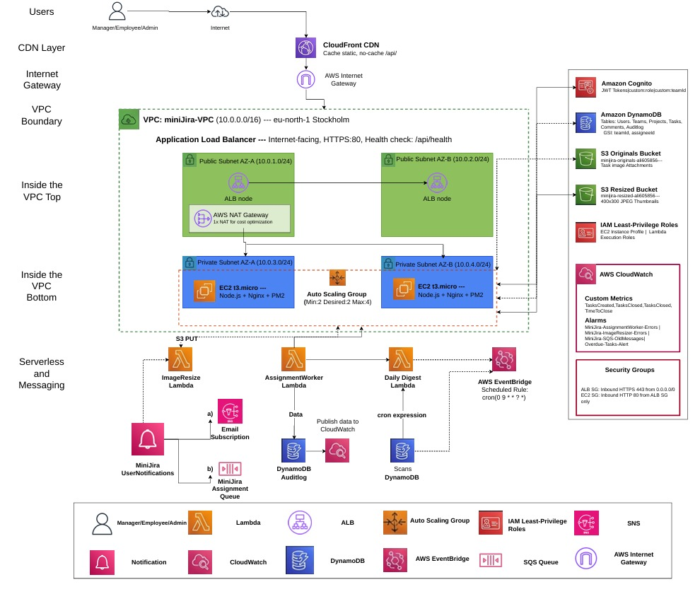
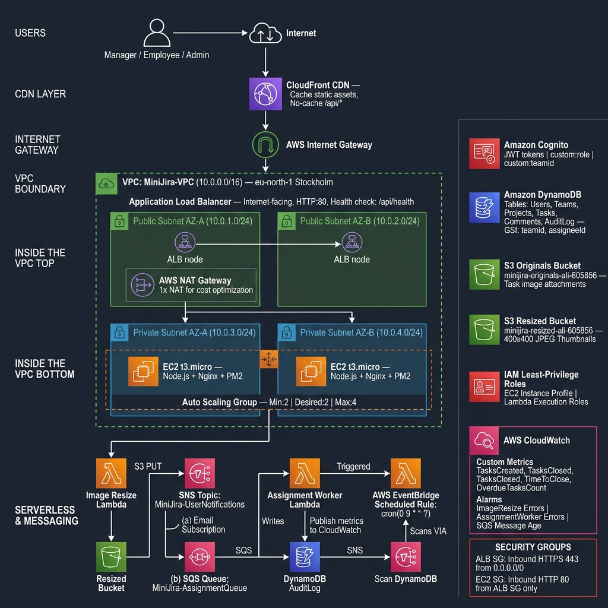

# Mini-Jira on AWS — Team Anti-Gravity

> **Live Demo:** https://d9lm1us8lvrs3.cloudfront.net
> **GitHub Repo:** https://github.com/ziad102828/Mini-JiraAWS
> **Submission Date:** May 22, 2026
> **Region:** eu-north-1 (Stockholm)

> **Note for Evaluators:** In the time of the evaluation, please email me at: ali.abouelanin@student.giu-uni.de so I can start the ASG (Auto Scaling Group) to make the live site work.

---

## 🚀 Quick Start

### Test Accounts

| Role | Email | Password | Access |
|------|-------|----------|--------|
| **Manager** | ali@minijira.com | Test123! | All teams, create/assign tasks, audit log |
| **Employee (Frontend)** | sara@minijira.com | Test123! | Frontend team tasks only |
| **Employee (Backend)** | omar@minijira.com | Test123! | Backend team tasks only |

> **Note:** EC2 instances may be stopped post-submission to minimize cost. They can be restarted for grading by setting Auto Scaling Group desired capacity to 2.

---

## 🏗️ Architecture Overview

> **Note on Diagrams:** We originally designed our architecture diagram in draw.io to ensure 100% technical accuracy. To make it visually stunning for our demo, we enhanced it using an AI tool (which introduced a few minor text typos like the AZ labels). Both versions are provided below for transparency!

### 1. Original Draw.io Diagram (Technically Accurate)


### 2. AI Enhanced Diagram (Visually Polished)


### High Availability Design
- **2 Availability Zones** (eu-north-1a, eu-north-1b) for fault tolerance
- **Auto Scaling Group** (Min:2, Desired:2, Max:4) — self-healing infrastructure
- **Application Load Balancer** distributes traffic across instances with `/api/health` checks
- **CloudFront CDN** for global low-latency delivery (static assets cached, `/api/*` bypassed)
- **Private subnets** for EC2 instances — no direct public internet access
- **1 NAT Gateway** in AZ-A for cost-optimized outbound internet access *(HA option: 2 NAT Gateways at double the cost)*

---

## 🎯 Key Features Demonstrated

### ✅ Role-Based Access Control (Cognito)
- AWS Cognito User Pool with custom attributes: `custom:role`, `custom:teamId`
- JWT tokens validated on **every** API request via middleware
- Two roles: **Manager** (full access) and **Employee** (team-scoped)

### ✅ Team Isolation (Server-Enforced)
- Employees see **only** their team's tasks
- Manager sees all tasks with team filter dropdown
- DynamoDB GSI query on `teamId` enforces cross-team access prevention at the data layer

### ✅ Full Task Lifecycle (Kanban Board)
- Drag-and-drop Kanban board (To Do → In Progress → In Review → Done)
- Every status change logged to `MiniJira_AuditLog` DynamoDB table
- Comments with full CRUD (Create, Read, Update, Delete)
- Image attachments on tasks

### ✅ Event-Driven Notification Architecture
```
Task Assignment → SNS Topic (MiniJira-TaskAssignment)
├── (a) Email Subscription → Assignee notification email
└── (b) SQS Queue (MiniJira-AssignmentQueue)
    └── Assignment Worker Lambda
        ├── Writes audit record to DynamoDB AuditLog
        └── Publishes CloudWatch custom metric (AssignmentsProcessed)
```

### ✅ Serverless Image Processing Pipeline
```
User uploads image → S3 PUT (minijira-originals-ali-605856)
→ S3 Event triggers Image Resize Lambda
→ Sharp library resizes to 400×400 JPEG (quality: 85)
→ Saves thumbnail to S3 Resized Bucket (minijira-resized-ali-605856)
→ Frontend fetches thumbnail via presigned URL (expires 1 hour)
```

### ✅ Daily Digest (EventBridge Scheduler)
- Runs every day at **9:00 AM UTC** via cron `(0 9 * * ?)`
- Paginated DynamoDB Scan for tasks due today or overdue
- Groups tasks by assignee, sends personalized summary email via SNS
- Publishes `OverdueTasksCount` metric to CloudWatch

### ✅ CloudWatch Monitoring & Alerting
**Dashboard:** `MiniJira-Overview`
| Widget | Metric |
|--------|--------|
| Lambda Invocations | All 3 functions |
| Lambda Errors | Spike detection |
| S3 Storage Growth | Both buckets |
| SQS Message Traffic | AssignmentQueue |
| Custom: TasksCreated | Per team |
| Custom: TasksClosed | Time-to-close |
| Custom: OverdueTasksCount | Daily |

**Alarms (3 configured):**
- `MiniJira-ImageResizer-Errors` — fires if Lambda errors > 1 in 5 min
- `MiniJira-AssignmentWorker-Errors` — fires if Lambda errors > 1 in 5 min
- `MiniJira-SQS-OldMessages` — fires if messages stuck > 5 min

---

## 🛠️ Tech Stack

### Frontend
- **React 18 + Vite** — fast SPA build
- **Vanilla CSS** — custom glassmorphism dark theme
- **@dnd-kit** — drag-and-drop Kanban board
- **TanStack Query (React Query)** — server state management
- **Amazon Cognito** SDK — authentication and JWT management

### Backend
- **Node.js 20 + Express** — REST API
- **AWS SDK v3** — DynamoDB, S3, SNS, SQS, CloudWatch
- **PM2** — process management and auto-restart
- **Nginx** — reverse proxy and static file server

### Infrastructure (19 AWS Services)
- VPC, Public/Private Subnets, NAT Gateway, Internet Gateway
- EC2 Auto Scaling Group, Application Load Balancer
- CloudFront CDN
- DynamoDB (6 tables, 2 GSIs)
- S3 (2 buckets)
- Lambda (3 functions)
- SNS + SQS
- EventBridge
- Cognito
- CloudWatch + Alarms
- IAM (least-privilege roles)

---

## 📊 All 19 AWS Services

| # | Service | Role |
|---|---------|------|
| 1 | **EC2 (Auto Scaling)** | Hosts Node.js backend across 2 AZs |
| 2 | **Application Load Balancer** | Distributes traffic, health checks `/api/health` |
| 3 | **CloudFront** | CDN — caches static assets, bypasses cache for `/api/*` |
| 4 | **VPC** | Isolated private network (10.0.0.0/16) |
| 5 | **Public Subnets (x2)** | ALB and NAT Gateway placement |
| 6 | **Private Subnets (x2)** | EC2 instances — no direct internet access |
| 7 | **NAT Gateway** | Outbound internet for EC2 (GitHub clone, npm install) |
| 8 | **DynamoDB** | Users, Teams, Projects, Tasks, Comments, AuditLog |
| 9 | **S3 (Originals)** | Raw task image attachments |
| 10 | **S3 (Resized)** | 400×400 JPEG thumbnails |
| 11 | **Lambda — Image Resize** | S3 PUT trigger → Sharp resize → Resized bucket |
| 12 | **Lambda — Assignment Worker** | SQS consumer → audit log → email → metrics |
| 13 | **Lambda — Daily Digest** | EventBridge trigger → scan tasks → email digest |
| 14 | **SNS** | Fan-out notifications for assignments |
| 15 | **SQS** | Decoupled queue for assignment processing |
| 16 | **EventBridge** | Cron scheduler — daily digest at 9:00 AM UTC |
| 17 | **Cognito** | User authentication, JWT, custom:role, custom:teamId |
| 18 | **CloudWatch** | Dashboard, 6 custom metrics, 3 alarms |
| 19 | **IAM** | EC2 Instance Profile + Lambda execution roles |

---

## 📂 Project Structure

```text
Mini-JiraAWS/
├── client/                     # React frontend (Vite)
│   └── src/
│       ├── components/
│       │   ├── kanban/         # Kanban board, TaskCard, TaskDetailModal
│       │   └── layout/         # Sidebar, MainLayout
│       ├── pages/              # Dashboard, Tasks, Analytics, Projects, Teams
│       ├── context/            # AuthContext (Cognito)
│       └── lib/                # API client
├── server/                     # Express backend (Node.js 20)
│   └── src/
│       ├── routes/             # API endpoints (tasks, teams, projects, etc.)
│       ├── services/           # Database and AWS services
│       ├── middleware/         # Auth and team isolation
│       └── config/             # Environment & SDK configurations
└── infrastructure/             # AWS configuration & IaC scripts
    ├── lambda/
    │   ├── image-resize/       # Serverless image processing (sharp)
    │   ├── assignment-worker/  # SQS consumer (audit log + email)
    │   └── daily-digest/       # EventBridge cron scheduled notifications
    ├── cloudwatch/             # Dashboard and custom alarm scripts
    ├── sns/                    # SNS topic configuration
    ├── sqs/                    # SQS queue creation
    ├── s3-sns/                 # S3 bucket and trigger setup
    └── users/                  # Cognito test users creation script
```

---

## 🔐 Security Highlights

| Security Measure | Implementation |
|-----------------|----------------|
| **Private subnets for EC2** | No direct public internet access to backend |
| **Cognito JWT validation** | Every API route validates token via middleware |
| **Team isolation (server-side)** | DynamoDB GSI enforces cross-team data access |
| **Security Groups** | ALB: 443 from internet. EC2: 80 from ALB only |
| **IAM least-privilege** | EC2 instance profile; Lambda roles scope to specific actions |
| **Presigned S3 URLs** | Upload URLs expire in 5 min; View URLs expire in 1 hour |
| **No credentials in code** | All secrets via environment variables on EC2 |

---

## 💰 Cost Optimization

**5-Day Total Deployment Cost: ~$8–10**

| Resource | Cost |
|----------|------|
| NAT Gateway | $5.40 (5 days × $1.08/day) |
| EC2 (above free tier) | ~$2.50 |
| All other services | ~$0 (free tier / pay-per-use) |

**Strategies Applied:**
- ✅ **1 NAT Gateway** instead of 2 (saves ~$32/month; HA tradeoff accepted for cost)
- ✅ **ASG desired = 0** when not testing (stops EC2 billing)
- ✅ **DynamoDB On-Demand** — pay per request, zero idle cost
- ✅ **Lambda** — only charged per invocation, not idle

---

## 🏆 Engineering Challenges Overcome

### 1. Sharp Binary Compatibility (Lambda on Linux)
**Problem:** Installing `sharp` on Windows produced binaries incompatible with Lambda's Linux runtime.
**Solution:** Used AWS CloudShell (Linux) to install and package `sharp`, ensuring correct glibc-linked binaries.

### 2. Double-Wrapped JSON (SNS → SQS → Lambda)
**Problem:** Lambda received SQS records where the body was a JSON string containing another JSON string (SNS envelope wrapping). Caused `SyntaxError: Unexpected token`.
**Solution:** Double JSON parse with graceful fallback:
```javascript
const snsMessage = JSON.parse(record.body);      // SQS body = SNS envelope
const taskData = JSON.parse(snsMessage.Message); // SNS message = actual task data
```

### 3. CloudFront Caching API Responses
**Problem:** CloudFront cached API calls, causing users to see stale task data.
**Solution:** Created a dedicated cache behavior for `/api/*` path with `Managed-CachingDisabled` policy, while keeping `CachingOptimized` for static React assets.

### 4. Hardcoded `localhost` in Production Frontend
**Problem:** `TaskDetailModal.jsx` fetched image URLs from `http://localhost:5000/api/upload/view-url/...`. In production, browsers couldn't resolve localhost.
**Solution:** Changed to relative path `/api/upload/view-url/...` — Nginx on EC2 proxies to the Express server.

### 5. Image Viewing from Wrong S3 Bucket
**Problem:** Backend `view-url` endpoint generated presigned URLs from the Originals bucket instead of the Resized bucket, causing large file transfers.
**Solution:** Updated `server/src/routes/upload.js` to read from `S3_BUCKETS.RESIZED`.

---

## 🎥 Demo Video

[**Watch Full Demo**](YOUR-YOUTUBE-LINK-HERE) *(Add after recording)*

**Demo covers:**
1. Architecture diagram walkthrough
2. Manager creates and assigns task with image upload
3. Employee login — team isolation in action
4. Drag-and-drop Kanban status update
5. Image thumbnail display (Lambda resize pipeline)
6. CloudWatch dashboard
7. Live high-availability test — stop one EC2, app keeps running, ASG auto-replaces

---

## 📎 Links

- **GitHub Repository:** https://github.com/ziad102828/Mini-JiraAWS
- **Live Application:** https://d9lm1us8lvrs3.cloudfront.net
- **Demo Video:** *(add YouTube link)*
- **AWS Region:** eu-north-1 (Stockholm)

---

## ⚠️ Grading Note

EC2 instances are stopped post-submission (ASG desired=0) to minimize cost.

**To restart for grading:**
1. Go to AWS Console → EC2 → Auto Scaling Groups
2. Select `MiniJira-ASG` → Edit
3. Set Desired: 2, Min: 2 → Save
4. Wait 3–5 minutes for instances to boot and pass health checks
5. CloudFront URL will work again: https://d9lm1us8lvrs3.cloudfront.net
